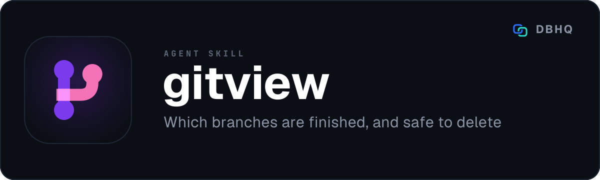

<div align="center">



# gitview

**Which branches are finished, and which only look like they are**

[](LICENSE)
[](https://code.claude.com/docs/en/plugins)
[]()

A free, open-source tool by [DBHQ](https://dbhq.uk) - documented at [skills.dbhq.uk](https://skills.dbhq.uk/gitview/)

</div>

---

## What makes it different

One table: worktree, branch, open pull request, ahead, behind, unpushed, and
whether the branch is safe to delete.

The last column is the one that is hard. A branch merged by squash stays ahead of
the trunk forever while contributing nothing, so commit counts cannot answer it
and `git branch --merged` never sees it. gitview merges the trunk into a
throwaway copy of each branch and compares the resulting tree against the
trunk's. If they match, the branch adds nothing and can go.

Both cheap checks fail **silently**, which is the worst failure mode available:
the answer looks right. That is the whole reason this skill exists.

## Install

### As a Claude Code plugin (recommended)

```
/plugin marketplace add dbhq-uk/marketplace
/plugin install gitview@dbhq
```

### Any agent (Cursor, Copilot, Windsurf, Gemini, Cline and more)

```bash
npx skills add dbhq-uk/gitview-skill
```

The [skills.sh](https://skills.sh) CLI installs into whichever agent directories
it finds, so this works outside Claude Code and Codex too.

### Local install (Claude Code or Codex)

```bash
git clone https://github.com/dbhq-uk/gitview-skill.git
cd gitview-skill
./install.sh          # Claude Code: symlinks into ~/.claude/skills (edits are live)
./install-codex.sh    # Codex: installs into ~/.codex/skills
```

[`install.sh`](install.sh) and [`install-codex.sh`](install-codex.sh) are the
same install two ways: Claude Code substitutes `${CLAUDE_SKILL_DIR}`, so the
whole skill directory is symlinked untouched, while Codex does not, so its
`SKILL.md` is rewritten at install time. Re-run the Codex one after editing
`SKILL.md`.

### Requirements

Python 3 and `git`. Optionally `gh` or the Azure CLI, for the pull request
column.


## Requirements

Python 3, standard library only, and `git`. Nothing else: the safe-to-delete
check is answered from the repository in front of it rather than from a
forge API, which is why it works on a private remote you cannot query.

## Use

Talk to your agent: "survey the branches in this repo", "what can I delete",
"which of these are actually finished".

It shows the table first, then offers deletions, and asks before each one. It
will not delete a branch that has a worktree or an open pull request, it
re-verifies each branch immediately before it goes, and it prints the commit SHA
so a wrong call can be undone.

**gitview itself deletes nothing.** `gitview.py` is read only - it never deletes,
pushes, merges, or checks out an existing branch. The deletions are run by the
agent in your session, where you can see them and your own tool permissions
apply.

## How the safe-to-delete check works

Read [`skills/gitview/references/safe-to-delete.md`](skills/gitview/references/safe-to-delete.md)
before changing anything in that logic.

In short: for each branch, gitview creates a throwaway git index and a detached
worktree outside your repository, merges the trunk into a copy of the branch, and
compares the resulting tree to the trunk's. Identical trees mean the branch
contributes nothing, whatever its ahead count says. Both temporary artefacts are
removed when the check finishes; your working tree and your index are never
touched.

Design: [docs/superpowers/specs/2026-09-10-gitview-design.md](docs/superpowers/specs/2026-09-10-gitview-design.md)

## Also from DBHQ

Fifteen free agent skills, all of them installable from the same marketplace and
all documented at **[skills.dbhq.uk](https://skills.dbhq.uk)**.

| Skill | What it does |
|---|---|
| [outlook](https://skills.dbhq.uk/outlook/) | Microsoft 365 mail and calendar, from the terminal |
| [trello](https://skills.dbhq.uk/trello/) | Your boards, run from your agent |
| [legwork](https://skills.dbhq.uk/legwork/) | Research that settles a decision, and says when it cannot |
| [dovetail](https://skills.dbhq.uk/dovetail/) | Checks whether your repository still agrees with itself |
| [verve](https://skills.dbhq.uk/verve/) | Strips AI tells from prose and puts a voice back |
| [vela](https://skills.dbhq.uk/vela/) | Compiler-exact code search, in any language you index |
| [garmin](https://skills.dbhq.uk/garmin/) | Your Garmin data, answered in the terminal |
| [imager](https://skills.dbhq.uk/imager/) | Images from GPT Image 2, costed before it spends |
| [atlassian](https://skills.dbhq.uk/atlassian/) | Jira issues and Confluence pages |
| [pennyblack](https://skills.dbhq.uk/pennyblack/) | A physical letter, posted from the terminal |
| [buildwork](https://skills.dbhq.uk/buildwork/) | Your open issues, run as parallel agents |
| [deskwork](https://skills.dbhq.uk/deskwork/) | What an agent noticed, tracked as real work |
| [groupwork](https://skills.dbhq.uk/groupwork/) | A second agent on the work, adversary or partner |

Plus [heliograph](https://skills.dbhq.uk/heliograph/), for a machine you cannot log into.

## Licence

MIT. See [LICENSE](LICENSE).
